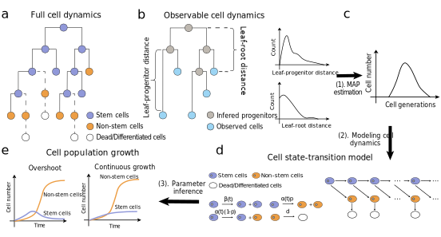

.. scPhyloX documentation master file, created by
   sphinx-quickstart on Mon May 13 17:07:01 2024.
   You can adapt this file completely to your liking, but it should at least
   contain the root `toctree` directive.

scPhyloX - single cell Phylodynamics explorer
=============================================================================

**scPhyloX** is a computational framework to perform phylodynamics inference and reconstruct tissue developmental history dynamics. Through the branch length (LP distance and LR distance) distributions of the phylogenetic tree, phylodynamics parameters during tissue development and tumorgensis can be quantitatively inferred by scPhyloX.

.. toctree::
   :caption: Main
   :maxdepth: 1
   :hidden:
   
   Installation
   
   
.. toctree::
   :caption: Tutorials
   :maxdepth: 1
   :hidden:
   
   notebooks/GettingStart
   notebooks/Simulation
   notebooks/Inference
   notebooks/VisualizeResults